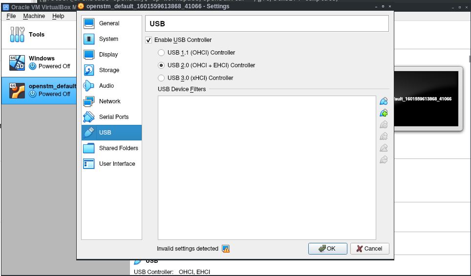

# Template project for the STM32F4Discovery Board


This is a template repository for getting the main peripherals working on a [STM32F4Discovery](https://www.st.com/en/evaluation-tools/stm32f4discovery.html#sw-tools-scroll) board.

+ [Toolchain](#Toolchain)
+ [Flash-Tool](#Flash-Tool)
+ [Vagrant](#Vagrant)
  
  + [Requirements](#Requirements)
  + [Vagrant box](#Vagrant%20box)
  + [How To](#How%20To)
  + [Troubleshooting](#Troubleshooting)
+ [Additional Resources](#Additional%"0Resources)
  
  + [STM32CubeF4](#STM32CubeF4)
  + [Credits](#Credits)
  
    


## Toolchain

To get all dependencies and be ready to flash the STM32F4 Board, install the following packages on Debian-based distributions:
```bash
apt install cmake libusb-dev libusb-1.0-0-dev build-essential autoconf \
cutecom git binutils-arm-none-eabi gcc-arm-none-eabi
```

On `arch` you can prepare your system with those packages:
```bash
pacman -S arm-none-eabi-gcc arm-none-eabi-binutils arm-none-eabi-newlib \
cmake autoconf git stlink
```

## Flash-Tool

The newest Flash-Tool for the STM-Boards can be found at [STLINK](https://github.com/texane/stlink). Clone it and make a debian package, which then can be installed via dpkg:

```bash
git clone https://github.com/texane/stlink  
cd stlink  
make clean  
 make package  
sudo dpkg -i build/Release/stlink-*-amd64.deb  
sudo ldconfig # refresh library list for st-link
```


## Vagrant

### Requirements

+ Working Virtualbox ([guide](https://www.virtualbox.org/wiki/Downloads))

+ Virtualbox Extension ([guide](https://www.nakivo.com/blog/how-to-install-virtualbox-extension-pack/))

+ Working Vagrant Installation ([guide](https://learn.hashicorp.com/tutorials/vagrant/getting-started-install?in=vagrant/getting-started))

  

### Vagrant box

clone the Repo (or only the Vagrantfile) and copy it to where u want to install it

```bash
git clone https://github.com/mborko/stm32f4-template
cd stm32f4-template
cp Vagrantfile /installation/directory/
cd /installation/directory/
```


Create a VM with the Vagrantfile and stop it again

```bash
vagrant up
vagrant halt
```

**Notice:** *vagrant also creates a shared directory in the current directory called `workspace`*


Add a USB Controller through Virtualbox (VM needs to be Powered Off) and add the Microcontroller (may need to be repeated for each device)

+ openstm > Settings > USB > Enable USB Controller > USB 2.0 > Add USB Filter  > STM32F4




Start the VM again (same directory as Vagrantfile)

```bash
vagrant up
```


### How To

Connect to the VM (same directory as Vagrantfile)

```bash
vagrant ssh
```


change into the `stm32f4-template` directory and make the project

```bash
cd stm32f4-template
make clean
make
```


#### Change Code

First create a Directory in Workspace

```bash
mkdir ~/workspace/my-project
```

Copy the template into your project

```bash
cp -R src/template/* ~/workspace/my-project
```

Now you can edit the `main.c` (example uses vim editor)

```bash
vim ~/workspace/my-project/Src/main.c
```

**Notice:**  *you can also change the code through your host by accessing the Shared director `workspace`*


#### Flash to Device

in order to flash the device use the following Command

```bash
make flash
```

If you want to use your the non default directory `src/template` use the following command

```bash
make flash PROJ=/path/to/your/project 
```

For the example in [Change Code](#Change Code):

```bash
make flash PROJ=~/workspace/my-project
```


### Troubleshooting

### Flash

Incase the flash fails just unplug and plug your device again.


## Additional Resources

### STM32CubeF4
Clone the [STM32Cube-F4](https://github.com/STMicroelectronics/STM32CubeF4) Library to the ```~/opt``` Folder or any other destination.
Check the **STM32_PATH** Definition in the Makefile and change it aproperly.

Further Documentation and the Manuals can be found here:  
* [Getting started with STM32CubeF4 firmware](http://www.st.com/st-web-ui/static/active/en/resource/technical/document/user_manual/DM00107720.pdf)  
* [Discovery kit for STM32F407/417](http://www.st.com/st-web-ui/static/active/en/resource/technical/document/user_manual/DM00039084.pdf)  
* [STM32F4xx HAL drivers](http://www.st.com/st-web-ui/static/active/en/resource/technical/document/user_manual/DM00105879.pdf)  
* [STM32F3 and STM32F4 Series Cortex®-M4 programming manual](http://www.st.com/web/en/resource/technical/document/programming_manual/DM00046982.pdf)  
* [STM32F405xx/07xx, STM32F415xx/17xx, STM32F42xxx and STM32F43xxx advanced ARM®-based 32-bit MCUs](http://www.st.com/web/en/resource/technical/document/reference_manual/DM00031020.pdf)  

## Credits
Thanks to Fabian Greif for his minimal example [repository](https://github.com/dergraaf/stm32f3_minimal) for the STM32F3-Discovery board.
I wish also to thank Matthew Blythe and 'mohammedari' for theier good startpoints:  
[Basic Template](https://github.com/mblythe86/stm32f3-discovery-basic-template)  
[Test Makefile](https://github.com/mohammedari/stm32f3discovery-test-c)  
[STM32CubeF4 Makefile Template Project](https://github.com/theotime/STM32CubeF4_makefile_template.git)  

